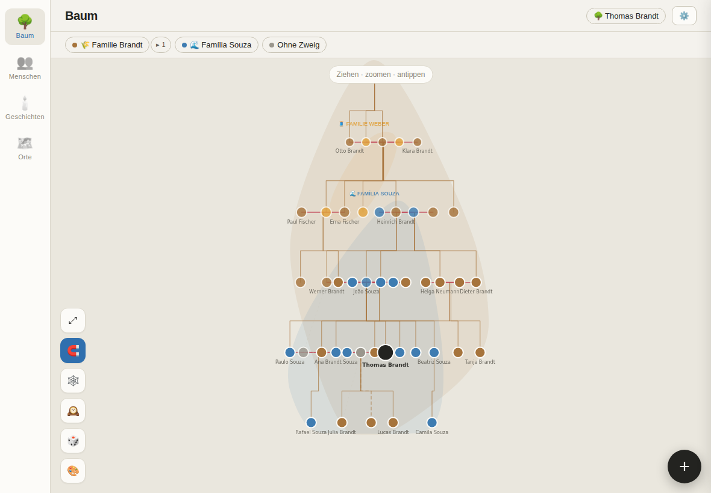
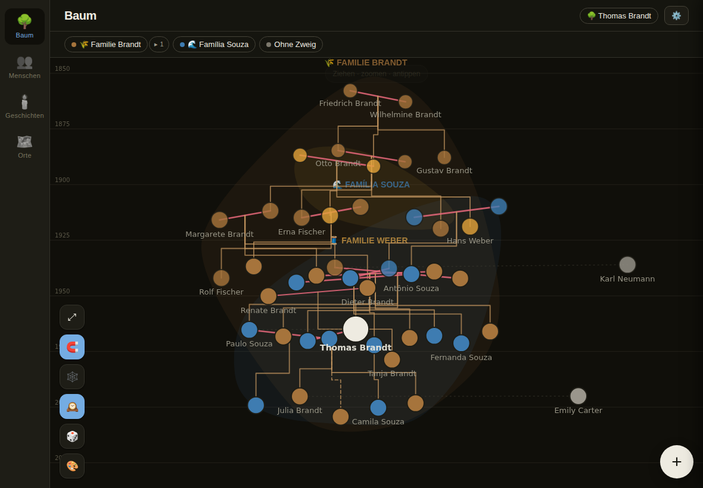
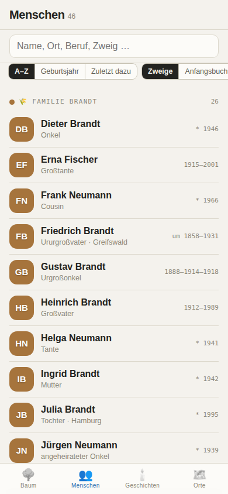

# Ancestor Map

*A living, touchable map of a family across generations.*

Ancestor Map is a self-hosted web app for building and exploring a family
tree the way you'd wander a map, not fill in a database: an organic canvas of
people and generations you pinch, pan and long-press through, with facts,
stories and places attached to everyone — and the whole tree readable from
any person's perspective.

It is the sibling of [Friend-Map](https://github.com/martemagua/friend-map)
and inherits its philosophy: one small container, your own hardware, zero
running costs, no telemetry — and no personal data anywhere near this public
repository. Everything below is the seeded fictional demo family.

| The tree, by generations | The same tree on the time axis |
|---|---|
|  |  |

## What it does

- **The tree as a map.** A force-assisted layout: generations are hard rows,
  everything else settles organically. Couples stand together on a union
  bar; children hang from it on genealogy elbows (dashed when adopted or
  fostered). Zoom out and family branches melt into named, coloured blobs;
  zoom in and names, years and connections earn their place one by one.
  Long-press anyone to light up their whole immediate world.
- **Zeit mode.** One toggle re-seats everyone at their **birth year** on a
  faint decade ruler — generations shear and overlap the way history did.
  Missing years are estimated from the family around them.
- **Any person as the centre.** *View the tree from here* re-reads the whole
  tree from that person: generations recount and every kinship label —
  "Ururgroßmutter", "tataravô", "first cousin once removed" — recomputes,
  in the viewer's language.
- **Fuzzy dates as first-class values.** `1885`, `1885-03-14`, `~1885`,
  `<1920`, `1914..1918` — parsed, sorted and localized; anything else stays
  honest free text.
- **Branches as layers.** A married-in family is its own toggleable,
  coloured layer; branches nest, and membership is inherited upward.
- **Connections beyond blood.** Godparents, wedding witnesses, an exchange
  family — described free-text relationships that live on cards and as thin
  threads on the map, whether or not the person is in the tree at all.
- **Stories.** Life events and anecdotes with fuzzy dates, places and the
  people who were there; every card shows its person's timeline.
- **Places.** Births, deaths and stories on a hand-written OpenStreetMap
  slippy map, with a decade slider to drag through time. Geocoding runs
  server-side within Nominatim's usage policy.
- **Three languages from the first string.** German, Brazilian Portuguese
  and English — the app follows the browser until an account picks its own.
- **A whole family, safely.** Roles (admin / editor / viewer), single-use
  invitation links that carry their role, per-account notes and hypotheses
  layered over the shared documented record, read-only API tokens for
  automations, nightly backups, and full JSON export/import.
- **GEDCOM export.** Your data walks out whole into any genealogy tool —
  fuzzy dates, adoption pedigrees and the documented record included.
- **Ask your tree anything.** A built-in read-only **MCP server** lets AI
  agents query the family over an API token:
  `claude mcp add --transport http ancestormap https://your-host/mcp
  --header "Authorization: Bearer am_…"` — then ask "how is Maria related
  to me?" or "what do we know about Wilhelm's years in Brazil?". Nothing
  leaves your machine unless your own agent carries it.



## Quick start

```bash
docker compose up -d --build   # http://localhost:4322
```

Or without Docker (Node >= 22.5, no npm install — there are no runtime
dependencies):

```bash
npm run dev                    # http://localhost:4322, data in ./data
```

On first visit the app walks you through creating the admin account. Family
members join through invitation links minted on `/admin`.

To try it with the fictional demo family first:

```bash
npm run seed && npm run dev
```

Running it on TrueNAS SCALE — including the test-instance / stable-instance
setup and the `dev` → `main` release flow — is walked through in
[docs/DEPLOY.md](docs/DEPLOY.md).

### Deployment notes

- All state lives in one SQLite file under `DATA_DIR` (default `/data` in
  the container) — bind-mount it and it is the only thing to back up.
  Nightly backups (JSON + a consistent `.db` copy) land in
  `DATA_DIR/backups` on their own.
- Put a reverse proxy with TLS in front for anything beyond the LAN, and
  set `TRUST_PROXY=1` so rate limiting sees real client addresses.
  Installing as a PWA needs a secure origin.
- Environment: `PORT` (4322), `DATA_DIR`, `TZ`, `BACKUP_KEEP` (30),
  `TRUST_PROXY`, `NOMINATIM_URL` (optional, own instance). Everything else
  is configured in the app and stored in the database.
- Locked out? `docker exec -it ancestormap node server/reset-password.js
  <username> <new-password>`.

## Development

```bash
npm run dev                  # dev server with watch, data in ./data
npm test                     # all suites (node:test, nothing to install)
npm run seed                 # fictional demo family into ./data
node tests/ui.smoke.mjs      # full browser walkthrough (needs Playwright)
node tests/busy.mjs shots/   # photograph the seeded tree in every mode
```

`CLAUDE.md` documents the architecture and the decisions behind it;
`PITCH.md` holds the product vision, `BACKLOG.md` the parked work
(GEDCOM, media libraries, Immich, an MCP server for AI access, 3D).

## Privacy

- Your family's data lives in one SQLite file on your machine and nowhere
  else. No telemetry, nothing phones home.
- Exports and backups never contain password hashes, session tokens or API
  keys.
- The only third-party requests are OpenStreetMap tiles and (server-side,
  throttled, cached) Nominatim geocoding — both within their public usage
  policies, both replaceable with your own instances.
- This repository never contains real personal data: `data/` is gitignored,
  and all fixtures and screenshots come from the seeded fictional family.

## License

[MIT](LICENSE)
